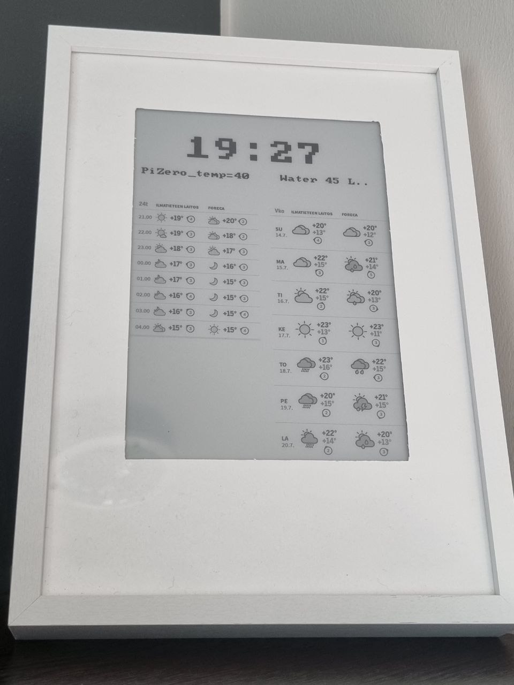
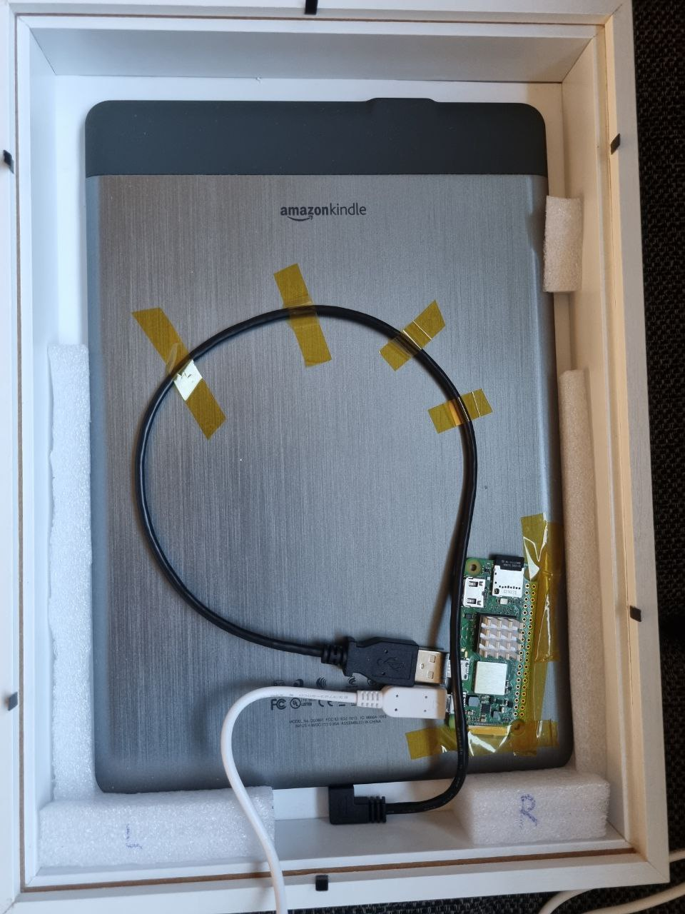
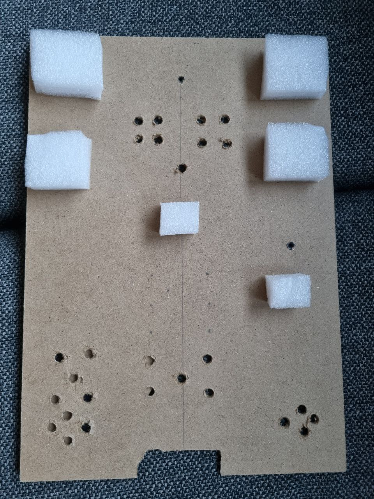

# Homeink

Transforming my old Kindle DX into a smart(ish) e-ink clock 🕙



## Intro

Back in 2010 I bought an Amazon Kindle DX, thinking that the large screen would be ideal for reading technical books in PDF format. Even though reading such books was *doable* overall, it required few compromises. In some cases, PDF books required a bit of preprocessing in order to crop empty margins. Despite that, PDFs with condensed charts or images were still difficult to interpret, and the zooming and navigation capabilities of the device were a bit underwhelming, especially with heavy files. In the end, I used the Kindle DX for reading mostly sci-fi books, and that was perfect especially when I learned how to hack the device and install [KOReader](https://github.com/koreader/koreader). That lasted for years until the battery started to give up due to its age. In 2021 I bought a Kobo Libra 2 and the Kindle went right into a drawer. I refused the idea of consiering the Kindle e-waste and that I should just get rid of it, so it went to a drawer waiting for a new opportunity.

And the opportunity came: I was looking to buy a large (around 10" or 12") display in order to display a Home Assistant dashboard and I suddenly remembered I still had my old Kindle. The major blocker is that the Kindle DX does not have any ethernet or wi-fi connecitivy (only networking available is the built-in 3G radio for Amazon Whispernet, which has been defunct for years). On the other hand, a Raspberry Pi Zero 2 W has all the networking I need and is tiny. Considering I already hacked the Kindle back in the days, I started to explore the idea of coupling them and see if I could control the Kindle display from the Pi Zero.

## Preparations

### Kindle

I installed the latest version of the USBNetwork hack from [this post in Mobileread](https://www.mobileread.com/forums/showthread.php?t=88004). Installation is straight-forward, just following the instractions and making sure I am getting the correct .bin file for the DX model.

I also installed [FBInk](https://github.com/NiLuJe/FBInk) to control the e-ink display, which is a great alternative to the default `eips` command.

### Pi Zero

I installed DietPi because I had an unused 2 GB micro SD card unused and I didn't want to buy a new one. I roll with the defaults, but I added a new network interface in order to being able to SSH to the Kindle over [RNDIS](https://en.wikipedia.org/wiki/RNDIS):

```
dietpi@DietPi:~$ cat /etc/network/interfaces.d/usb0
auto usb0
iface usb0 inet static
address 192.168.2.1
netmask 255.255.255.0
```

I also adjusted the cpu governor to powersave and few tweaks here and there, but nothing important other than adding the new network interface.

### Frame

I bought a 3d picture frame that was big enough to hold the kindle and handcrafted a passepartout with thick cardstock paper to hide the Kindle frame and keyboard. I secured the Pi Zero with kapton tape, drilled some holes in the back for ventilation and added a bit of foam to make sure the Kindle does not move inside the frame.

<table>
  <tr>
    <td align="center" valign="middle">
      <p>Inside the frame</p>
      
    </td>
    <td align="center" valign="middle">
      <p>Back cover</p>
      
    </td>
  </tr>
</table>


## Software

### Homeink

The main software is called `Homeink` and is a Go application that gets installed in the Pi Zero device. In a nutshell:

- It provides a small wrapper to the FBInk tool, and it runs `fbink` commands over SSH thanks to the [goph](https://github.com/melbahja/goph) library.
- It is also a small HTTP server that currently exposes two endpoints available in the local network. At the moment there are two endpoints:
  - `/api/v1/screenshot` that accepts an image to be rendered in the display. Used to render local weather forecasts from [Supersää](https://supersaa.fi).
  - `/api/v1/water`, that is used to show the daily water consumption in our home.

The HTTP server also exposes a Swagger UI under `/swagger/index.html`, which is useful to test the endpoints, especially the screenshot endpoint because it is a multipart request.

Oh, and of course it shows the current time! 😅

Also it shows the cpu temperature of the Pi Zero, which is something I want to keep an eye as the Zero is confined in a tight place. In the future, I might end up using Telegram bot notifications instead.

### Supersää screenshots

Code is under the `docker-supersaa-screenshots` directory. It is a separated Go application, but it lives in the same repository for simplicity. The application uses [chromedp](https://github.com/chromedp/chromedp) to periodically take screenshots of specific components of Supersää, it converts the screenshots to 16-bit grayscale (which is what the Kindle DX display can handle) and calls the `/api/v1/screenshot` from `Homeink`. There is a very rudimentary caching in place, so I do not need to send and re-render the same images over and over again, albeit the hourly forecast are updated several times per hour.

Chromedp and the Go application are bundled into a single docker image, and the container runs on my home server within my home network. My main motivation was to reduce as much as possible the processing work required by the Pi Zero.

### Water usage

Not exactly an application, but listing here for documenting purposes. At home I monitor our water consumption with a great ESPHome device from [smart-stuff.nl](https://smart-stuff.nl/product/esphome-waterlezer-dongle/). I am not extremely interested in tracking the liters or cost, but with two young kids I wanted to have Home Assistant automations that would warn me if the water consumption goes above some thresholds based on our common water usage patterns (more than 30 liters in the last 15 minutes, more than 60 liters in the last hour, etc).

In Home Assistant, I use the [RESTFul Command](https://www.home-assistant.io/integrations/rest_command/) integration and created two services in `configuraiton.yaml`, one for the Pi Zero device and another for my local computer for testing:

```yaml
[core-ssh ~]$ cat homeassistant/configuration.yaml
...
rest_command:
  liters_request_dev:
    url: http://dietpi.lan:3000/api/v1/water
    method: POST
    headers:
      accept: "application/json"
    payload: '{"liters": {{ liters_placeholder }}}'
  liters_request:
    url: http://mbm3pro.lan:3000/api/v1/water
    method: POST
    headers:
      accept: "application/json"
    payload: '{"liters": {{ liters_placeholder }}}'
```

Then I added a new automation that calls teh /api/v1/water endpoint from `Homeink` every five minutes:

```yaml
[core-ssh ~]$ cat homeassistant/automations/water_report_kindle.yaml
- alias: Water report to kindle
  trigger:
      - platform: time_pattern
        minutes: "/5"
  action:
    - service: rest_command.liters_request
      data:
        liters_placeholder: >-
          {{ states('sensor.watermeter_daily')|int }}
```
